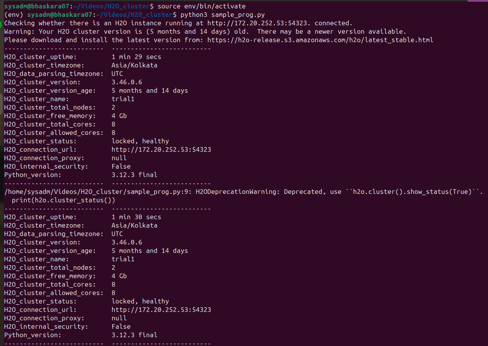

# 🔥 Distributed Wildfire Confidence Prediction using H2O.ai


> A multiclass classification project leveraging a **2-node distributed H2O cluster** and a **Distributed Random Forest (DRF)** model to predict wildfire confidence levels using **VIIRS SNPP 2023 global data**.

---

## 📌 Highlights
The primary objective of this project is to:
- Build a **high-accuracy wildfire classification system**
- Utilize **distributed computing** to handle large-scale satellite data
- Deploy a **Distributed Random Forest (DRF)** model via H2O.ai
- Evaluate performance using real metrics like **AUC, Accuracy, F1-score**
- Enable analysis across all countries using 2023 fire records
---


---

## 🧾 Overview

This project presents a scalable, distributed machine learning solution to predict wildfire confidence levels using satellite data. By leveraging the power of a **2-node H2O.ai distributed cluster**, it processes **2023 global VIIRS SNPP Active Fire data** to classify each fire event into **Low**, **Nominal**, or **High** confidence categories.

The project includes:
- Distributed model training using H2O’s DRF algorithm
- End-to-end pipeline: preprocessing, training, evaluation
- Real-world application on global fire datasets from NASA FIRMS

---

## 🎯 Objective

The primary objective of this project is to:
- Build a **high-accuracy wildfire classification system**
- Utilize **distributed computing** to handle large-scale satellite data
- Deploy a **Distributed Random Forest (DRF)** model via H2O.ai
- Evaluate performance using real metrics like **AUC, Accuracy, F1-score**
- Enable analysis across all countries using 2023 fire records

---

## 🔥 Motivation

With climate change accelerating wildfire incidents worldwide, early detection and classification of fires are critical for emergency response, planning, and resource management. Satellite data, especially from **NASA's VIIRS SNPP**, provides near real-time coverage of global fire events.

However, processing such large datasets requires scalable tools. This motivated the use of:
- **Distributed H2O.ai framework** for handling computation across machines
- **Machine learning** to automate fire classification
- **Open global datasets** for transparency and reproducibility

This project bridges the gap between environmental data availability and real-time decision-making by creating a system that’s fast, scalable, and accurate.

---


## 📍 Course Project | Ramakrishna Mission Vivekananda Educational and Research Institute, Belur Math  
🧠 Team: Tom and Jerry  
👨‍💻 Members: Kanan Pandit , Sudam Paul  
📅 Date: April 26, 2025
## 📂 Repository Structure

```plaintext
wildfire_pred_h2o/
├── Final_Distributed_ML_using_H2O Framework.ipynb   # Main notebook
├── 📊 Project Report: Predictive Modeling using H2O.ai.pdf  # Final report
├── flatfile.txt                                     # H2O node list for cluster
├── requirements.txt                                  # Python dependencies
├── csv_merge.py                                # for merging multiple csv
├── README.md                                        # This file

```

## 📦 Dataset

This project uses **NASA VIIRS SNPP Active Fire/Hotspot Data (375m, Near Real-Time)** for the **entire year of 2023**, covering **all countries worldwide**.

### 🔗 Official Data Sources

- 🌍 **Global Fire Data Download**: [https://firms.modaps.eosdis.nasa.gov/download/](https://firms.modaps.eosdis.nasa.gov/download/)  
- 🌐 **Country-wise Fire Data Viewer**: [https://firms.modaps.eosdis.nasa.gov/country/](https://firms.modaps.eosdis.nasa.gov/country/)

This dataset includes active fire points detected globally by the **Suomi National Polar-orbiting Partnership (SNPP)** satellite using the **VIIRS sensor at 375m resolution**.

### 📄 Data Overview

- **Satellite**: VIIRS SNPP  
- **Temporal Coverage**: January 1 – December 31, 2023  
- **Spatial Coverage**: 🌍 All countries (global)  
- **Resolution**: 375 meters  
- **Projection**: WGS84 (latitude/longitude)  
- **Format**: CSV (also available as KML, SHP via FIRMS)

---
## 📎 Full Cluster Setup Guide Available At:
[kananpandit02/h2o_cluster_setup](https://github.com/kananpandit02/h2o_cluster_setup)


### 🔍 Feature Summary

| Feature     | Description                                |
|-------------|--------------------------------------------|
| `latitude`  | Fire latitude (WGS84)                      |
| `longitude` | Fire longitude (WGS84)                     |
| `brightness`| Brightness of fire detection               |
| `scan`      | Width of the scan footprint                |
| `track`     | Length of the scan footprint               |
| `acq_date`  | Date of fire detection                     |
| `acq_time`  | Time of fire detection (UTC)               |
| `satellite` | SNPP satellite ID                          |
| `confidence`| Confidence level (Low, Nominal, High)      |
| `frp`       | Fire Radiative Power (MW)                  |
| `daynight`  | Day or Night detection                     |
| `version`   | Collection version info                    |

> ⚠️ **Dataset is not included in this repository** due to size constraints.

📥 **To use the same dataset**:
- Go to: [https://firms.modaps.eosdis.nasa.gov/download/](https://firms.modaps.eosdis.nasa.gov/download/)
- Select:
  - **Sensor**: VIIRS SNPP 375m  
  - **Region**: Global  
  - **Date Range**: 01 Jan 2023 to 31 Dec 2023  
  - Format: CSV


---

## 🛠️ Dataset Preparation

All raw `.csv` files from different countries were merged into a single unified dataset for training:

- **Script Used:** `csv_merge.py`
- **Output File:** `Wildfire_prediction.csv`

To merge:
```bash
csv_merge.py
```

---
## ⚙️ How to Run the Project

### 1. Clone the Repository

```bash
git clone https://github.com/kananpandit02/wildfire_pred_h2o.git  
cd wildfire_pred_h2o
```
### 2. Install Dependencies
```bash
pip install -r requirements.txt
```
### 3. Launch the Notebook
```bash
jupyter notebook
```
Then open Final_Distributed_ML_using_H2O_Framework.ipynb and run the cells step-by-step.
### 🌐 Distributed H2O Cluster Setup
This project utilizes two physical machines on a private network to build a distributed H2O cluster.

## ⚙️ Setup Steps:
Ensure both machines are connected to the same network.

Create a flatfile.txt that lists the IP addresses of each node, e.g.:
```bash

192.168.0.101
192.168.0.102
```
On each machine, run the following command:
```bash

java -Xmx4g -jar h2o.jar -name wildfire-cluster -flatfile flatfile.txt
```
## 📎 Full Cluster Setup Guide Available At:
[kananpandit02/h2o_cluster_setup](https://github.com/kananpandit02/h2o_cluster_setup)


## 🤖 AutoML Pipeline

- **Platform:** H2O AutoML (multi-node)
- **Notebook:** `Final_Distributed_ML_using_H2O Framework.ipynb`
- **Tasks Covered:**
  - Cluster initialization
  - Data import and exploration
  - Automatic training of multiple models
  - Leaderboard evaluation
  - Model interpretation
  - Final prediction

📄 Additional explanation is provided in `AutoML.txt`.

---

## 📘 Notebook Overview – `Final_Distributed_ML_using_H2O Framework.ipynb`

This notebook demonstrates a complete, distributed machine learning workflow using the H2O framework.

### 🔹 Steps Covered:

1. **Environment Setup**
   - Warnings suppressed, visualization style set.
   - H2O cluster initialized using `h2o.init(ip="172.20.252.53", port=54323)`.

2. **Data Loading**
   - Data loaded from:
     ```python
     h2o.upload_file("Wildfire_prediction.csv")
     ```

3. **Exploratory Data Analysis**
   - Sample records, data schema, null checks, summary stats.

4. **Feature Engineering**
   - Column conversion, data cleaning.
   - Train/validation/test split:
     ```python
     train, valid, test = data.split_frame(ratios=[0.7, 0.15], seed=1234)
     ```

5. **AutoML Training**
   - Automatically trains models using:
     ```python
     from h2o.automl import H2OAutoML
     aml = H2OAutoML(max_models=10, seed=1, max_runtime_secs=600)
     aml.train(y="target_column", training_frame=train, validation_frame=valid)
     ```

6. **Model Leaderboard**
   - AutoML leaderboard includes GBM, XGBoost, DRF, GLM, and Ensembles.

7. **Evaluation**
   - Leader model is evaluated on test set.
   - Metrics and visualizations include AUC, LogLoss, variable importance.

8. **Prediction and Export**
   - Final predictions saved as:
     ```python
     preds = aml.leader.predict(test)
     preds.as_data_frame().to_csv("wildfire_predictions.csv")
     ```

---

### 🌲 Manual Random Forest Model (Outside AutoML)

In addition to AutoML, the notebook also trains a standalone **Random Forest Classifier** using `H2ORandomForestEstimator` for predicting wildfire confidence levels.

#### Model Details:
- **Target Variable:** `confidence` (converted to categorical)
- **Features:** All columns except `confidence`
- **Model Parameters:**
  ```python
  rf_model = H2ORandomForestEstimator(ntrees=30, max_depth=20, seed=1234)
  rf_model.train(x=x, y=y, training_frame=train, validation_frame=valid)
  ```

The model is trained and summarized to compare.
#### 📈 Model Performance: 

| Metric                | Value    |
|-----------------------|----------|
| RMSE                  | 0.1721   |
| MSE                   | 0.02964  |
| Mean Per Class Error  | 0.070    |
| LogLoss               | 0.0961   |


---

## 📈 Output Highlights

- Models Trained:
  - GBM, DRF, XGBoost, GLM, Deep Learning, Stacked Ensembles
  - Manual Random Forest
- Evaluation Metrics:
  - MSE, RMSE, LogLoss, Variable Importance
- Output:
  - In Progress............


---
## 🖥️ Sample Visualization
> Screenshots of the H2O cluster setup and Output of ML models.



## 📜 Data Citation & Disclaimer

**Citation**:  
Cite this dataset as:  
> NASA FIRMS. 2023. *VIIRS 375m Active Fire Data (Suomi NPP)*. NASA FIRMS, LANCE/EOSDIS, NASA.  
> Available at: [https://earthdata.nasa.gov/earth-observation-data/near-real-time/citation](https://earthdata.nasa.gov/earth-observation-data/near-real-time/citation)

**Disclaimer**:  
The LANCE/FIRMS data is provided “as is” without warranty of any kind.  
Users assume all responsibility and liability for the use of this data, including any resulting loss, damage, or misuse.  
NASA and its data providers are not liable for any consequence of data use.

For full terms and guidance, refer to:  
- 🔗 [FIRMS FAQ](https://firms.modaps.eosdis.nasa.gov/faq/)  
- 🔗 [NASA Data Use Policy](https://earthdata.nasa.gov/earth-observation-data/data-use-policy)


### 🙏 Acknowledgements

Special thanks to:

**Champak Kumar Dutta**  
Assistant Professor, Department of Data Science  
RKMVERI, Belur Math, West Bengal  

For his guidance, mentorship, and continuous encouragement.
## ⚠️ License

This project is intended for **academic use only** and is **not licensed for commercial or production deployment**.  
**No license is granted.**  
Please contact the authors for further usage rights.

---

## 🧾 Concluding Remarks

This project demonstrates how distributed machine learning can be effectively applied to real-world environmental challenges like wildfire detection. By combining high-resolution satellite data from NASA FIRMS with H2O.ai’s scalable distributed computing framework, we achieved robust wildfire confidence prediction across global datasets.

Key highlights include:
- Successful deployment of a 2-node H2O cluster
- High accuracy using a Distributed Random Forest model
- Full pipeline from data ingestion to evaluation
- End-to-end wildfire prediction pipeline using distributed ML.
- Manual model comparison using Random Forest.
- Understanding of H2O AutoML in real-world settings.
- Hands-on experience with H2O cluster setup and orchestration.

This solution can serve as a baseline for building more advanced, real-time wildfire monitoring systems that can support global climate resilience and disaster management efforts.

The methodology, tools, and open datasets used in this project make it not only effective but also reproducible and adaptable for further research, extension, or production use in academic and government settings.

---

## 🌐 Connect With Us

### 👨‍💻 Kanan Pandit  
🌐 [Portfolio](https://kananpanditportfolio.netlify.app/)  
✉️ kananpandit02@gmail.com  

### 👨‍💻 Sudam Paul  
🌐 [Portfolio](https://sudam23.github.io/My_Portfolio/)  
✉️ 2002sudam@gmail.com  

### 🏫 Institution  
**Ramakrishna Mission Vivekananda Educational and Research Institute**  
📍 *Belur Math, Howrah, West Bengal*
